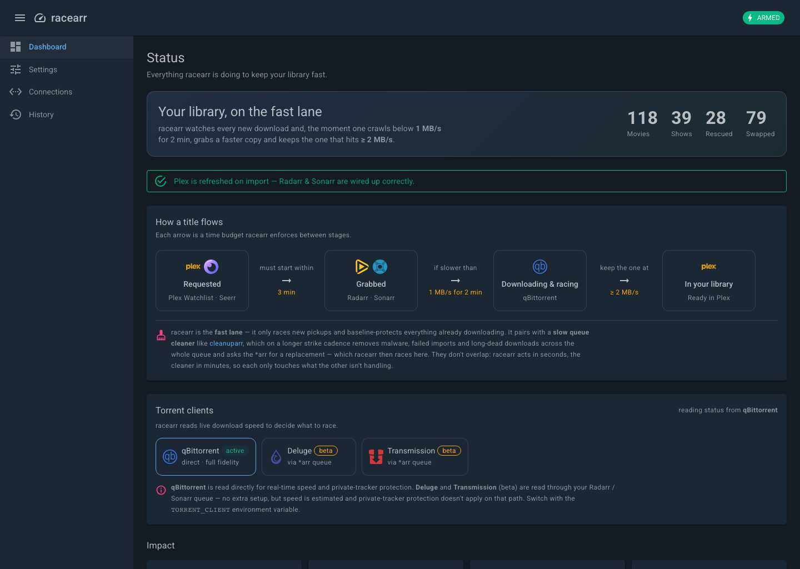
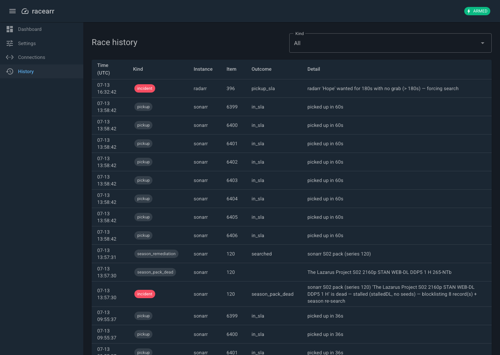
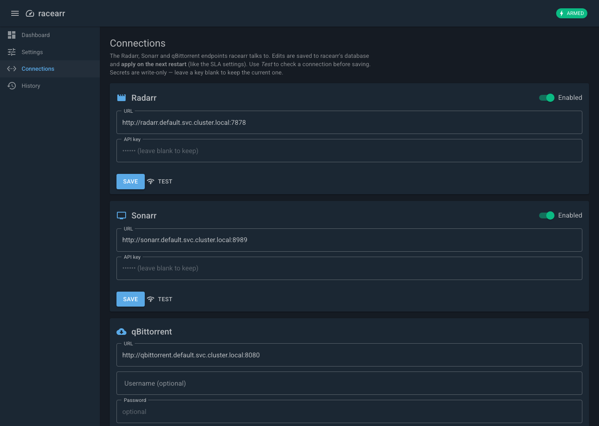
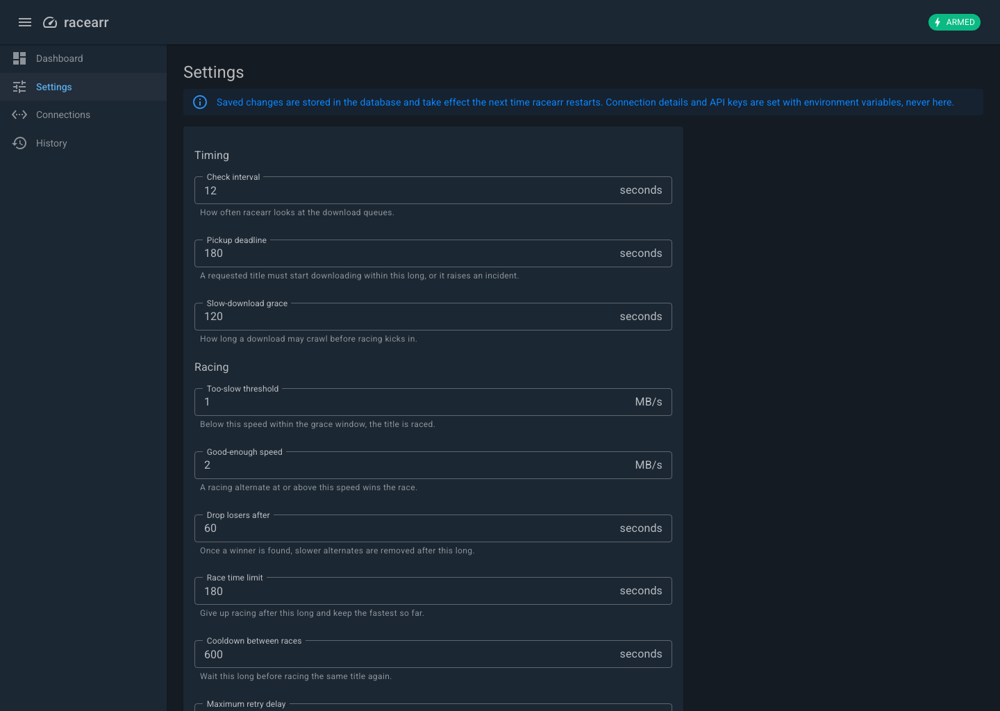
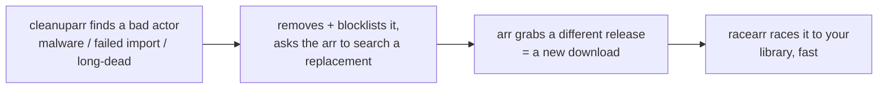
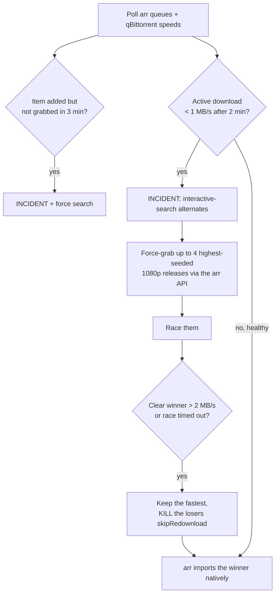

# racearr

**The *fast lane* for your \*arr downloads: when a grab is slow, racearr races
several well-seeded alternates in parallel and keeps the fastest — it's not a
strike-and-remove cleaner.**

Radarr and Sonarr grab exactly **one** release per item and rank candidates by
*custom-format score* — **not by seeders**. So a "high quality" release with 3
seeders can win and then crawl for hours, and nothing steps in fast. The usual
tools (swaparr, cleanuparr, decluttarr) *strike and remove* the slow download and
let the arr re-search **one** replacement, sequentially — minutes to hours.
`racearr` is the fast lane: it enforces two hard SLAs and, when a download is
slow, **force-grabs up to N high-seeded same-quality alternates at once, races
them, and keeps the fastest — killing the losers**. Seconds, not strike cycles.

It's a compact **.NET 10 / ASP.NET Core** service that drives everything through
the Radarr/Sonarr APIs and reads qBittorrent **read-only** for live speeds,
persisting its tunable settings and race history in a local **SQLite** database.

> **Status:** production — the .NET 10 service runs on `main` and supersedes the
> original stdlib-only Python (see [ADR-0001](docs/adr/0001-dotnet-rewrite.md)).
> Multi-arch images (amd64 + arm64) are published at `ghcr.io/dragoshont/racearr`.
> Works with Radarr v3+ / Sonarr v3+ and qBittorrent v4.1+ (WebUI API v2). Torrents
> only. Starts in `DRY_RUN` — it watches and logs what it *would* do until you arm it.

---

## Screenshots

<p align="center">
  
</p>

<p align="center">
  
  
  
</p>

<sub>Dashboard, race history, connection setup and tunable SLAs — the dark-mode MudBlazor UI on port `9797`.</sub>

---

## The problem

When you add something to your watchlist, the pipeline usually crawls for one of these reasons:

- **Selection ignores seeders.** The \*arr apps pick by CF score; a low-seed release can outrank a well-seeded one.
- **No minute-scale fast-fail.** Tools like cleanuparr only remove a slow torrent after tolerating very low speeds for *hours*.
- **No plan B.** Once a slow release is grabbed, the item just sits there until something eventually gives up.

`racearr` turns "hours, and I had to intervene" into "minutes, hands-off".

## Works alongside a queue cleaner — no overlap

The \*arr community rightly warns against running two tools that fight over the
same queue. `racearr` is deliberately **not** a queue cleaner: it is the **fast
lane**, and it composes cleanly with a **slow janitor** like
[cleanuparr](https://github.com/Cleanuparr/Cleanuparr) rather than duplicating it.

| | **racearr** (fast lane) | **cleanuparr** (slow janitor) |
|---|---|---|
| Watches | *new* pickups only (baseline-protects everything present at startup) | the *whole* queue + the missing backlog |
| Reacts in | **seconds** — parallel racing | **minutes** — ≥ 3 strikes over a ~15-min cadence |
| Removes | losing race alternates + obvious fakes | malware, failed imports, long-dead downloads, finished seeds |

They don't collide because they act on **different time scales**: racearr always
finishes a race (< 3 min) long before a cleaner accumulates enough strikes
(≈ 45 min) to touch anything — so the cleaner only ever acts on downloads racearr
is *not* racing (post-race degradation, plus the backlog racearr ignores).

**The handoff** — *"if a cleaner finds a bad actor, racearr replaces it fast"* —
needs no extra wiring; it flows through the \*arr:



If the cleaner can't trigger the search, the item simply goes back to *wanted*
and racearr's **pickup SLA** searches + races it anyway.

## What it does — the SLA contract

| SLA | Trigger | Action |
|---|---|---|
| **Pickup** | An item becomes *wanted* but isn't grabbed within `PICKUP_SLA_SECONDS` (default **3 min**) | Raise an **incident**, force a search |
| **Speed** | An active download isn't at **≥ `SPEED_SLA_MBPS`** (default 1 MB/s) within `SPEED_SLA_SECONDS` (default 2 min) | Raise an **incident**, grab up to **`MAX_CONCURRENT_PER_ITEM`** (default 4) highest-seeded 1080p alternates, race them, keep the fastest (> `RACE_TARGET_MBPS`, default 2 MB/s), **kill the losers** |

Incidents are emitted as structured `INCIDENT` log lines (and optionally to a webhook), so a breach is visible instead of silent.

---

## How it works

Every `POLL_SECONDS` (default 12s), racearr pulls each \*arr queue and the
qBittorrent torrent list, joins them by info-hash, and evaluates every managed
item:



### 1. It works *through* the \*arr API, not around it
Every grab and every removal is a normal \*arr API call:

- **Grab an alternate:** `POST /api/v3/release` with the release's `guid` + `indexerId`.
- **Kill a loser:** `DELETE /api/v3/queue/{id}?removeFromClient=true&blocklist=true&skipRedownload=true`.

Because the winner was grabbed *by the arr*, the arr tracks it and **imports it
natively** — no manual-import reconciliation, and `skipRedownload=true` stops the
arr from auto-searching a replacement and fighting racearr. qBittorrent is only
ever **read** (per-torrent `dlspeed` by hash).

### 2. The trick that makes racing possible
Racing needs **same-quality** alternates (a 1080p that's better-seeded than the
1080p you're stuck on). But the \*arr apps auto-reject those:

> `Quality for release in queue already meets cutoff: Bluray-1080p`

That rejection only means *"not an upgrade"* — the release is perfectly grabbable.
A manual `POST /release` **force-grabs past it** (the same as "override & grab" in
the UI). So racearr accepts releases that are rejected **only** for cutoff/upgrade
reasons, and skips ones rejected for real reasons (wrong quality, too big, etc.).
Candidates are capped at `RACE_MAX_RESOLUTION` (default 1080) — speed over quality,
never race a UHD alternate — and sorted by seeders descending.

### 3. Keep the fastest, kill the losers
Once a race is at least `RACE_CULL_AFTER_SECONDS` old and there's a clear winner
(≥ `RACE_TARGET_MBPS`), racearr removes every candidate except the fastest. If no
candidate reaches the target within `RACE_MONITOR_SECONDS`, it keeps the fastest
anyway and logs a `race_no_target` incident. The cull **persists across polls**, so
late-arriving alternates are also cleaned up until only the winner remains. After a
race, the item enters a `RACE_COOLDOWN_SECONDS` back-off so genuinely scarce content
(few seeders anywhere) doesn't churn.

### 4. Safety built in
- **Private trackers are protected.** racearr never grabs private alternates and never
  removes a private torrent from the client — it only detaches it from the arr queue so
  it keeps seeding (hit-and-run safety). Configure via `PROTECT_PRIVATE`,
  `PRIVATE_INDEXERS`, `PRIVATE_TRACKER_DOMAINS`.
- **Your existing backlog is never touched.** At startup racearr snapshots the current
  downloads and wanted items as a protected baseline; it only manages things that appear
  *after* it starts.
- **`DRY_RUN` first.** The default is observe-and-log-only. You watch the logs, then flip
  `DRY_RUN=false` to arm it.

---

## Quick start (Docker Compose)

```bash
git clone https://github.com/dragoshont/racearr.git
cd racearr
cp .env.example .env         # fill in RADARR_API_KEY / SONARR_API_KEY (+ qBit creds if needed)
docker compose pull          # GHCR image, linux/amd64 + linux/arm64
docker compose up -d         # starts in DRY_RUN
docker compose logs -f       # watch what it WOULD do
```

Published images are available at `ghcr.io/dragoshont/racearr`. `latest` follows
`main`; every `vX.Y.Z` release also publishes the immutable `X.Y.Z` tag, a commit-SHA
tag, provenance, and an SBOM. Pin a semver tag or digest for production deployments.

Point `RADARR_URL` / `SONARR_URL` / `QBIT_URL` at your services (defaults assume the
container can reach them as `radarr`, `sonarr`, `qbittorrent`). If your \*arr stack is a
separate compose project, attach racearr to that stack's network. When you're happy, set
`DRY_RUN=false` and `docker compose up -d`.

> **qBittorrent auth:** leave `QBIT_USERNAME`/`QBIT_PASSWORD` blank only if qBit is set to
> *bypass authentication for clients on localhost* or a whitelisted subnet; otherwise supply
> the WebUI credentials. qBittorrent is only read, never modified.

## Kubernetes

```bash
kubectl create secret generic racearr-secrets \
  --from-literal=RADARR_API_KEY=xxx --from-literal=SONARR_API_KEY=yyy
kubectl apply -k deploy/k8s          # DRY_RUN=true by default
kubectl set env deploy/racearr DRY_RUN=false   # arm it
```

Manifests are in [`deploy/k8s/`](deploy/k8s/). On a zero-trust cluster
(`default-deny-ingress`), also apply
[`networkpolicy.example.yaml`](deploy/k8s/networkpolicy.example.yaml).

---

## Unraid

racearr ships an **Unraid Community Applications** template. Until it's listed in
the CA store, add it manually:

1. In Unraid, open **Docker → Add Container** and set **Template** to the raw URL
   `https://raw.githubusercontent.com/dragoshont/racearr/main/templates/racearr.xml`
   (or add it under **Template repositories**).
2. Fill in your Radarr/Sonarr URLs + API keys and qBittorrent credentials, map
   `/config` to your appdata share, and start it — the WebUI is on port **9797**.
3. It starts in `DRY_RUN`; flip that toggle to `false` in the template once you're
   happy with what the logs show.

The template lives at [`templates/racearr.xml`](templates/racearr.xml).

---

## Configuration

All configuration is via environment variables. At least one of Radarr/Sonarr must be configured.

| Variable | Default | Meaning |
|---|---|---|
| `RADARR_URL` / `RADARR_API_KEY` | `http://localhost:7878` / — | Radarr; the API key enables it |
| `SONARR_URL` / `SONARR_API_KEY` | `http://localhost:8989` / — | Sonarr; the API key enables it |
| `QBIT_URL` | `http://localhost:8080` | qBittorrent WebUI (read-only) |
| `QBIT_USERNAME` / `QBIT_PASSWORD` | — | qBit login (omit if auth is bypassed for this client) |
| `TORRENT_CLIENT` | `qbittorrent` | `qbittorrent` (native, full live-speed fidelity) or `deluge` / `transmission` (**beta**: status read via the \*arr queue — estimated speed, no private-tracker protection on that path) |
| `DRY_RUN` | `true` | Observe-and-log only. Set `false` to arm. **Kill switch.** |
| `POLL_SECONDS` | `12` | Control-loop interval |
| `PICKUP_SLA_SECONDS` | `180` | Grab-within deadline before a pickup incident |
| `SPEED_SLA_SECONDS` | `120` | How long a download may be slow before racing |
| `SPEED_SLA_MBPS` | `1.0` | The "too slow" threshold |
| `RACE_TARGET_MBPS` | `2.0` | A "good enough" winner ends the race early |
| `RACE_CULL_AFTER_SECONDS` | `60` | Earliest a clear winner may end a race |
| `RACE_MONITOR_SECONDS` | `180` | Hard cap: keep the fastest, kill the rest |
| `RACE_COOLDOWN_SECONDS` | `600` | Back-off before re-racing the same item |
| `RACE_RETRY_MAX_SECONDS` | `21600` | Maximum exponential retry delay after empty/failed attempts |
| `MAX_CONCURRENT_PER_ITEM` | `4` | Max simultaneous candidates per item |
| `MAX_ACTIVE_RACES` | `6` | Global cap on concurrent races per instance |
| `RACE_MIN_SEEDERS` | `3` | Minimum seeders for a race candidate |
| `RACE_MAX_RESOLUTION` | `1080` | Never race an alternate above this (speed over quality) |
| `PROTECT_PRIVATE` | `true` | Never race/remove private-tracker torrents |
| `PRIVATE_INDEXERS` | — | Comma-separated indexer names to treat as private |
| `PRIVATE_TRACKER_DOMAINS` | — | Comma-separated tracker domains to treat as private |
| `INCIDENT_WEBHOOK_URL` | — | Incident webhook. **Discord** URLs are auto-detected and sent as `{"content":…}`; Slack/Mattermost/generic get `{"text":…}` |
| `NTFY_URL` / `NTFY_TOPIC` | — | Push incidents to [ntfy](https://ntfy.sh) (both required to enable) |
| `NTFY_TOKEN` / `NTFY_PRIORITY` | — | Optional ntfy access token (Bearer) and priority (`min`..`urgent`) |
| `TELEGRAM_BOT_TOKEN` / `TELEGRAM_CHAT_ID` | — | Send incidents via a Telegram bot (both required) |
| `GOTIFY_URL` / `GOTIFY_TOKEN` | — | Push incidents to [Gotify](https://gotify.net) (optional `GOTIFY_PRIORITY`, default `5`) |
| `PUSHOVER_TOKEN` / `PUSHOVER_USER` | — | Send incidents via [Pushover](https://pushover.net) (optional `PUSHOVER_PRIORITY`, `-2`..`2`) |
| `APPRISE_URL` | — | POST incidents to an [Apprise](https://github.com/caronc/apprise-api) endpoint (one URL → 100+ services; optional `APPRISE_TAG`) |
| `ARR_INSTANCES` | — | Extra \*arr instances beyond the primary, `;`-separated as `kind\|url\|apikey\|label` (see below) |
| `HEALTH_PORT` | `9797` | Port for the web UI, `/healthz`, `/status`, and `/metrics` |
| `DB_PATH` | `/config/racearr.db` | SQLite file for settings + race history (must be an absolute path) |
| `WEBHOOK_TOKEN` | — | Optional shared secret; when set, `POST /api/webhook/seerr` requires header `X-Webhook-Token` |
| `AUTH_PROXY` | `authentik` | Forward-auth scheme for the signed-in-user **display** only: `authentik`/`authelia`/`oauth2-proxy`/`tinyauth`/`traefik`/`generic`/`custom`/`none` (see [Access & authentication](#access--authentication)) |
| `LOG_LEVEL` | `INFO` | `INFO` / `DEBUG` |

### Notifications

racearr posts a short message on every incident (a pickup breach, a race, a dead
season pack). Every channel is **optional, off by default, and combinable**, and
delivery is fire-and-forget — a dead or slow endpoint never stalls or crashes the racer.

- **Discord** — paste a channel webhook into `INCIDENT_WEBHOOK_URL` (auto-detected).
- **Slack / Mattermost / generic** — point `INCIDENT_WEBHOOK_URL` at the incoming
  webhook; racearr sends `{"text": …}`.
- **ntfy** — `NTFY_URL` (e.g. `https://ntfy.sh`) + `NTFY_TOPIC` (+ optional
  `NTFY_TOKEN`, `NTFY_PRIORITY`).
- **Telegram** — `TELEGRAM_BOT_TOKEN` (from @BotFather) + `TELEGRAM_CHAT_ID`.
- **Gotify** — `GOTIFY_URL` + `GOTIFY_TOKEN` (+ optional `GOTIFY_PRIORITY`).
- **Pushover** — `PUSHOVER_TOKEN` + `PUSHOVER_USER` (+ optional `PUSHOVER_PRIORITY`).
- **Apprise** — `APPRISE_URL` (one [Apprise](https://github.com/caronc/apprise-api)
  endpoint fans out to 100+ services; optional `APPRISE_TAG`).

Notification tokens are read from the environment only, never persisted to the
database. Adding another channel is a single guarded block in
`IncidentNotifications.Build` plus its options.

### Multiple Radarr / Sonarr instances

The primary Radarr/Sonarr come from `RADARR_*` / `SONARR_*`. To race across more
than one of each (say a 1080p **and** a 4K Radarr), list the extras in
`ARR_INSTANCES` — a `;`-separated set of `kind|url|apikey|label` entries (`label`
optional):

```bash
ARR_INSTANCES="radarr|http://radarr-4k:7878|APIKEY|4k;sonarr|http://sonarr-anime:8989|APIKEY|anime"
```

Each instance gets a unique name in metrics and history (`radarr`, `radarr-4k`,
`sonarr`, `sonarr-anime`, …). The primary keeps its plain `radarr` / `sonarr`
labels, so existing dashboards keep working unchanged.

### Observability
- `GET /healthz` → `200 ok` (liveness).
- `GET /status` → JSON counters: `loops`, `incidents`, `races_started`, `candidates_grabbed`, `losers_killed`, `active_races`, `dry_run`, plus `downloads` (per managed download: `name`, `speed_bytes_per_sec`, `eta_seconds`, `progress`, `state`).
- `GET /metrics` → **Prometheus** exposition on the same `HEALTH_PORT` (stdlib-only, no deps). Scrape `:9797/metrics`. Series:
  - gauges: `racearr_up`, `racearr_dry_run`, `racearr_active_races`, `racearr_managed_downloads`, `racearr_loops_total`, `racearr_last_loop_age_seconds`
  - counters: `racearr_incidents_total{type}`, `racearr_pickups_total{instance,result}`, `racearr_races_started_total{instance}`, `racearr_race_attempts_total{instance,outcome}`, `racearr_candidates_grabbed_total{instance}`, `racearr_losers_killed_total{instance}`, `racearr_downloads_reached_target_total{instance}`, `racearr_race_outcomes_total{instance,outcome}`
  - histograms: `racearr_pickup_latency_seconds`, `racearr_time_to_target_seconds`, `racearr_race_winner_mbps`
  - Known label sets are pre-registered at `0`, so dashboards render clean zeros before the first event fires.
- A starter Grafana dashboard ships in [`deploy/grafana/racearr-dashboard.json`](deploy/grafana/racearr-dashboard.json) (expects a Prometheus datasource `uid: prometheus`; the logs panel expects a Loki datasource `uid: loki`).
- Every incident and every GRAB/KILL is logged.

---

## Access & authentication

racearr has **no built-in login** — like the \*arr apps themselves, its web UI is
open on its port and is meant to sit behind your reverse proxy. Put it behind the
same forward-auth / SSO you already use for Sonarr/Radarr and it's protected.

racearr can also **display** the signed-in user in the UI (informational only) by
reading your proxy's forward-auth headers. Point `AUTH_PROXY` at your provider:

| `AUTH_PROXY` | Headers read |
|---|---|
| `authentik` (default) | `X-authentik-username` / `-name` / `-email` / `-groups` |
| `authelia`, `tinyauth`, `traefik`, `generic` | `Remote-User` / `Remote-Name` / `Remote-Email` / `Remote-Groups` |
| `oauth2-proxy` | `X-Forwarded-User` / `-Preferred-Username` / `-Email` / `-Groups` |
| `custom` | your `AUTH_PROXY_USER_HEADER` / `_NAME_HEADER` / `_EMAIL_HEADER` / `_GROUPS_HEADER` |
| `none` | identity display disabled |

This is **display only** — racearr enforces nothing; the proxy at the ingress is the
real gate, and in-cluster callers (Prometheus `/metrics`, `/healthz`, `/status`, the
Seerr webhook) simply arrive anonymous. **A proxy is not required**: with `none` the
UI is open exactly like an unproxied Sonarr/Radarr, and racearr runs identically.

---

## Seerr / Overseerr integration (optional)

racearr can ingest **Seerr / Overseerr** webhook notifications to annotate its
race history with *who requested* each title. It is purely informational — a
webhook never starts, stops, or kills a download.

Wire it up in Seerr under **Settings → Notifications → Webhook**:

1. **Webhook URL** — `http://<racearr-host>:9797/api/webhook/seerr`. In Kubernetes
   use the in-cluster Service, e.g. `http://racearr-metrics.<namespace>.svc.cluster.local:9797/api/webhook/seerr`.
2. **Notification types** — enable the request-lifecycle events you care about
   (Request Pending / Approved / Automatically Approved / Available).
3. **JSON payload** — keep the **default** template. racearr reads its
   `notification_type`, `subject`, `media.media_type`, and
   `request.requestedBy_username` fields; `movie` requests are attributed to
   Radarr and `tv` to Sonarr.
4. Click **Test** — racearr returns `204` and ignores the test ping (no history row).

**Authentication.** The endpoint is unauthenticated by default and should be
protected at the network layer (e.g. a Kubernetes NetworkPolicy that only lets
the Seerr pod reach `:9797`). For defence in depth, set `WEBHOOK_TOKEN` on
racearr and add a custom header `X-Webhook-Token: <token>` to Seerr's webhook
config; racearr then requires a constant-time match and rejects anything else
with `401`.

---

## How it compares

| Tool | What it does | vs racearr |
|---|---|---|
| **cleanuparr / decluttarr / swaparr** | Strike a slow/stalled download and *sequentially* remove → re-search | racearr races **several candidates in parallel** and keeps the fastest — no wait-then-retry |
| **autobrr** | Grabs brand-new releases the instant they hit an indexer's announce | Complementary: autobrr front-runs *new* uploads; racearr fixes *slow grabs of anything* (incl. back-catalog) |
| **Prowlarr min-seeders** | Rejects low-seed releases at search time | Good to pair with racearr; it raises the floor but doesn't race |

racearr is happy to run **alongside** cleanuparr/decluttarr — let them handle
long-tail janitorial cleanup (failed imports, orphans, dead stalls) while racearr owns
the fast path.

## Limitations (honest)

- **It can't invent seeders.** If every release for an item is poorly seeded, racearr will
  try alternates and then keep the best available — which may still be slow.
- **Import speed is out of scope.** racearr gets a title *downloading* fast; how quickly the
  finished file is imported/moved into your library is your \*arr + storage setup.
- **Torrents only** (it reasons about seeders and qBittorrent live speed). No Usenet.
- **Season packs aren't *raced*** (racing is per single-episode grab) — but a dead
  or stalled season pack (one torrent → many episodes, vanished from the client or
  stuck with no seeds) is **blocklisted and re-searched at the season level**, so it
  no longer sits forever.

## Contributing

Issues and PRs welcome. It's a small .NET 10 solution
([`Racearr.slnx`](Racearr.slnx)) — `dotnet build` + `dotnet test` is the smoke test.

## License

[MIT](LICENSE) © 2026 Dragos Hont
