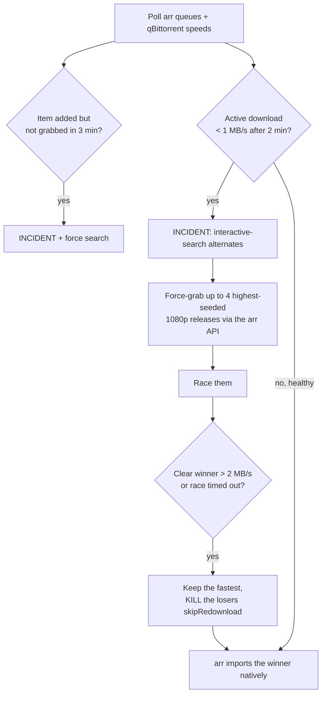

# racearr

**Aggressive download racer + hard pickup/speed SLAs for the \*arr stack.**

Radarr and Sonarr grab exactly **one** release per item and rank candidates by
*custom-format score* — **not by seeders**. So a "high quality" release with 3
seeders can win and then crawl for hours, and nothing steps in fast. `racearr`
fixes that: it enforces two hard SLAs and, when a download is slow, **races
several high-seeded alternates in parallel and keeps the fastest**, killing the
rest.

It's a single ~500-line, **dependency-free** Python service (stdlib only). It drives
everything through the Radarr/Sonarr APIs and reads qBittorrent **read-only** for
live speeds.

> **Status:** works with Radarr v3+ / Sonarr v3+ and qBittorrent v4.1+ (WebUI API v2).
> Torrents only. Starts in `DRY_RUN` — it watches and logs what it *would* do until you arm it.

---

## The problem

When you add something to your watchlist, the pipeline usually crawls for one of these reasons:

- **Selection ignores seeders.** The \*arr apps pick by CF score; a low-seed release can outrank a well-seeded one.
- **No minute-scale fast-fail.** Tools like cleanuparr only remove a slow torrent after tolerating very low speeds for *hours*.
- **No plan B.** Once a slow release is grabbed, the item just sits there until something eventually gives up.

`racearr` turns "hours, and I had to intervene" into "minutes, hands-off".

## What it does — the SLA contract

| SLA | Trigger | Action |
|---|---|---|
| **Pickup** | An item becomes *wanted* but isn't grabbed within `PICKUP_SLA_SECONDS` (default **3 min**) | Raise an **incident**, force a search |
| **Speed** | An active download isn't at **≥ `SPEED_SLA_MBPS`** (default 1 MB/s) within `SPEED_SLA_SECONDS` (default 2 min) | Raise an **incident**, grab up to **`MAX_CONCURRENT_PER_ITEM`** (default 4) highest-seeded 1080p alternates, race them, keep the fastest (> `RACE_TARGET_MBPS`, default 2 MB/s), **kill the losers** |

Incidents are emitted as structured `INCIDENT` log lines (and optionally to a webhook), so a breach is visible instead of silent.

---

## How it works

Every `POLL_SECONDS` (default 12s), racearr pulls each \*arr queue and the
qBittorrent torrent list, joins them by info-hash, and evaluates every managed
item:



### 1. It works *through* the \*arr API, not around it
Every grab and every removal is a normal \*arr API call:

- **Grab an alternate:** `POST /api/v3/release` with the release's `guid` + `indexerId`.
- **Kill a loser:** `DELETE /api/v3/queue/{id}?removeFromClient=true&blocklist=true&skipRedownload=true`.

Because the winner was grabbed *by the arr*, the arr tracks it and **imports it
natively** — no manual-import reconciliation, and `skipRedownload=true` stops the
arr from auto-searching a replacement and fighting racearr. qBittorrent is only
ever **read** (per-torrent `dlspeed` by hash).

### 2. The trick that makes racing possible
Racing needs **same-quality** alternates (a 1080p that's better-seeded than the
1080p you're stuck on). But the \*arr apps auto-reject those:

> `Quality for release in queue already meets cutoff: Bluray-1080p`

That rejection only means *"not an upgrade"* — the release is perfectly grabbable.
A manual `POST /release` **force-grabs past it** (the same as "override & grab" in
the UI). So racearr accepts releases that are rejected **only** for cutoff/upgrade
reasons, and skips ones rejected for real reasons (wrong quality, too big, etc.).
Candidates are capped at `RACE_MAX_RESOLUTION` (default 1080) — speed over quality,
never race a UHD alternate — and sorted by seeders descending.

### 3. Keep the fastest, kill the losers
Once a race is at least `RACE_CULL_AFTER_SECONDS` old and there's a clear winner
(≥ `RACE_TARGET_MBPS`), racearr removes every candidate except the fastest. If no
candidate reaches the target within `RACE_MONITOR_SECONDS`, it keeps the fastest
anyway and logs a `race_no_target` incident. The cull **persists across polls**, so
late-arriving alternates are also cleaned up until only the winner remains. After a
race, the item enters a `RACE_COOLDOWN_SECONDS` back-off so genuinely scarce content
(few seeders anywhere) doesn't churn.

### 4. Safety built in
- **Private trackers are protected.** racearr never grabs private alternates and never
  removes a private torrent from the client — it only detaches it from the arr queue so
  it keeps seeding (hit-and-run safety). Configure via `PROTECT_PRIVATE`,
  `PRIVATE_INDEXERS`, `PRIVATE_TRACKER_DOMAINS`.
- **Your existing backlog is never touched.** At startup racearr snapshots the current
  downloads and wanted items as a protected baseline; it only manages things that appear
  *after* it starts.
- **`DRY_RUN` first.** The default is observe-and-log-only. You watch the logs, then flip
  `DRY_RUN=false` to arm it.

---

## Quick start (Docker Compose)

```bash
git clone https://github.com/dragoshont/racearr.git
cd racearr
cp .env.example .env         # fill in RADARR_API_KEY / SONARR_API_KEY (+ qBit creds if needed)
docker compose up -d         # starts in DRY_RUN
docker compose logs -f       # watch what it WOULD do
```

Point `RADARR_URL` / `SONARR_URL` / `QBIT_URL` at your services (defaults assume the
container can reach them as `radarr`, `sonarr`, `qbittorrent`). If your \*arr stack is a
separate compose project, attach racearr to that stack's network. When you're happy, set
`DRY_RUN=false` and `docker compose up -d`.

> **qBittorrent auth:** leave `QBIT_USERNAME`/`QBIT_PASSWORD` blank only if qBit is set to
> *bypass authentication for clients on localhost* or a whitelisted subnet; otherwise supply
> the WebUI credentials. qBittorrent is only read, never modified.

## Kubernetes

```bash
kubectl create secret generic racearr-secrets \
  --from-literal=RADARR_API_KEY=xxx --from-literal=SONARR_API_KEY=yyy
kubectl apply -k deploy/k8s          # DRY_RUN=true by default
kubectl set env deploy/racearr DRY_RUN=false   # arm it
```

Manifests are in [`deploy/k8s/`](deploy/k8s/). On a zero-trust cluster
(`default-deny-ingress`), also apply
[`networkpolicy.example.yaml`](deploy/k8s/networkpolicy.example.yaml).

---

## Configuration

All configuration is via environment variables. At least one of Radarr/Sonarr must be configured.

| Variable | Default | Meaning |
|---|---|---|
| `RADARR_URL` / `RADARR_API_KEY` | `http://localhost:7878` / — | Radarr; the API key enables it |
| `SONARR_URL` / `SONARR_API_KEY` | `http://localhost:8989` / — | Sonarr; the API key enables it |
| `QBIT_URL` | `http://localhost:8080` | qBittorrent WebUI (read-only) |
| `QBIT_USERNAME` / `QBIT_PASSWORD` | — | qBit login (omit if auth is bypassed for this client) |
| `DRY_RUN` | `true` | Observe-and-log only. Set `false` to arm. **Kill switch.** |
| `POLL_SECONDS` | `12` | Control-loop interval |
| `PICKUP_SLA_SECONDS` | `180` | Grab-within deadline before a pickup incident |
| `SPEED_SLA_SECONDS` | `120` | How long a download may be slow before racing |
| `SPEED_SLA_MBPS` | `1.0` | The "too slow" threshold |
| `RACE_TARGET_MBPS` | `2.0` | A "good enough" winner ends the race early |
| `RACE_CULL_AFTER_SECONDS` | `60` | Earliest a clear winner may end a race |
| `RACE_MONITOR_SECONDS` | `180` | Hard cap: keep the fastest, kill the rest |
| `RACE_COOLDOWN_SECONDS` | `600` | Back-off before re-racing the same item |
| `MAX_CONCURRENT_PER_ITEM` | `4` | Max simultaneous candidates per item |
| `MAX_ACTIVE_RACES` | `6` | Global cap on concurrent races per instance |
| `RACE_MIN_SEEDERS` | `3` | Minimum seeders for a race candidate |
| `RACE_MAX_RESOLUTION` | `1080` | Never race an alternate above this (speed over quality) |
| `PROTECT_PRIVATE` | `true` | Never race/remove private-tracker torrents |
| `PRIVATE_INDEXERS` | — | Comma-separated indexer names to treat as private |
| `PRIVATE_TRACKER_DOMAINS` | — | Comma-separated tracker domains to treat as private |
| `INCIDENT_WEBHOOK_URL` | — | POST `{"text": ...}` on each incident (Discord/ntfy/etc.) |
| `HEALTH_PORT` | `9797` | Port for `/healthz` and `/status` |
| `LOG_LEVEL` | `INFO` | `INFO` / `DEBUG` |

### Observability
- `GET /healthz` → `200 ok` (liveness).
- `GET /status` → JSON counters: `loops`, `incidents`, `races_started`, `candidates_grabbed`, `losers_killed`, `active_races`, `dry_run`.
- Every incident and every GRAB/KILL is logged.

---

## How it compares

| Tool | What it does | vs racearr |
|---|---|---|
| **cleanuparr / decluttarr / swaparr** | Strike a slow/stalled download and *sequentially* remove → re-search | racearr races **several candidates in parallel** and keeps the fastest — no wait-then-retry |
| **autobrr** | Grabs brand-new releases the instant they hit an indexer's announce | Complementary: autobrr front-runs *new* uploads; racearr fixes *slow grabs of anything* (incl. back-catalog) |
| **Prowlarr min-seeders** | Rejects low-seed releases at search time | Good to pair with racearr; it raises the floor but doesn't race |

racearr is happy to run **alongside** cleanuparr/decluttarr — let them handle
long-tail janitorial cleanup (failed imports, orphans, dead stalls) while racearr owns
the fast path.

## Limitations (honest)

- **It can't invent seeders.** If every release for an item is poorly seeded, racearr will
  try alternates and then keep the best available — which may still be slow.
- **Import speed is out of scope.** racearr gets a title *downloading* fast; how quickly the
  finished file is imported/moved into your library is your \*arr + storage setup.
- **Torrents only** (it reasons about seeders and qBittorrent). No Usenet.
- **Season packs** are monitored but not raced (racing is per single-episode grab).

## Contributing

Issues and PRs welcome. The whole thing is one file, [`racearr.py`](racearr.py), stdlib only —
`python -m py_compile racearr.py` is the smoke test.

## License

[MIT](LICENSE) © 2026 Dragos Hont
